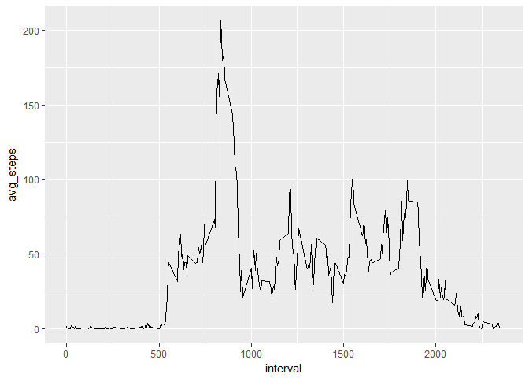
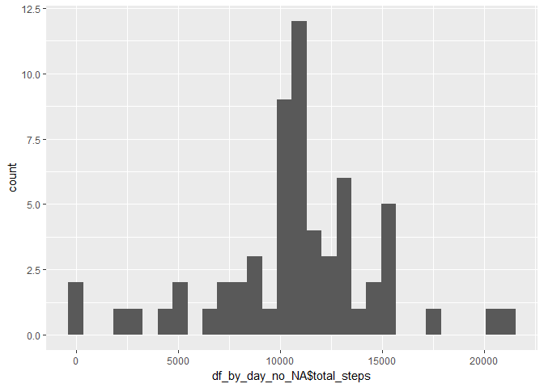
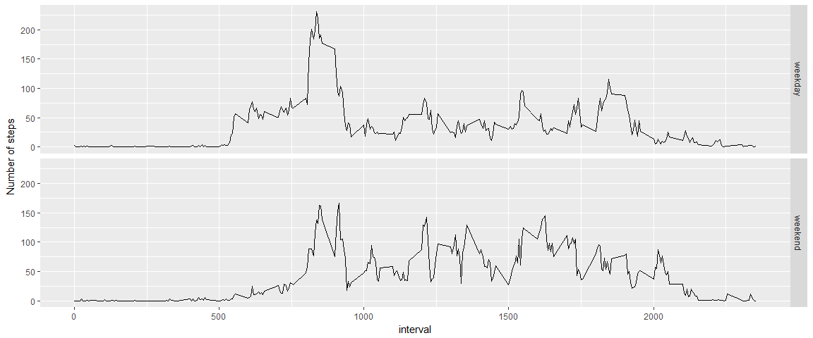

## Loading and preprocessing the data


```r
library(dplyr)
library(ggplot2)
```

```
## Warning: package 'ggplot2' was built under R version 3.4.2
```

```r
# Read input .csv file in a data frame:
df <- read.csv("activity.csv")

# Remove records with NA steps and group by date the remaining records
# summing steps, and store everything in a new data frame:
df_by_day <- df %>% select(steps, date) %>% 
             filter(!is.na(steps)) %>%
             group_by(date) %>% 
             summarise(total_steps=sum(steps))

# Make a histogram of the total number of steps taken each day: 
qplot(df_by_day$total_steps, geom="histogram")
```

<!-- -->

## What is mean total number of steps taken per day?


```r
# Calculate and report the mean and median total number of steps taken per day:
mean_steps <- mean(df_by_day$total_steps, na.rm=TRUE)
mean_steps_string <- format(mean_steps, nsmall=2)
median_steps <- median(df_by_day$total_steps, na.rm=TRUE)
median_steps_string <- format(median_steps, nsmall=2)
```
The mean number of steps is 10766.19 and the median number is 10765

## What is the average daily activity pattern?


```r
# Remove records with NA steps and compute the average of steps on each daily interval,
# storing everything in a new data frame:
df_by_interval <- df %>% select(steps, interval) %>% 
             filter(!is.na(steps)) %>%
             group_by(interval) %>% 
             summarise(avg_steps=mean(steps))

# Make a time series plot of the 5-minute interval (x-axis) and the average number of steps taken,
# averaged across all days (y-axis):
ggplot(data=df_by_interval, aes(x=interval, y=avg_steps)) + geom_line()
```

<!-- -->

```r
# Detect the 5-minute interval, on average across all the days in the dataset, 
# that contains the maximum number of steps:
max_interval_index <- which(df_by_interval$avg_steps == max(df_by_interval$avg_steps))
max_interval <- df_by_interval[max_interval_index, ]$interval
```
The interval with the maximum number of average steps is 835

## Imputing missing values


```r
# Calculate and report the total number of missing values in the dataset
NA_steps <- sum(is.na(df$steps))
NA_dates <- sum(is.na(df$date))
NA_intervals <- sum(is.na(df$interval))
```
There are 2304 records with steps=NA, 0 records with date=NA, 0 records with interval=NA.


```r
# Create a new dataset that is equal to the original dataset but with the missing data filled in
# Duplicate the original data frame
df_no_NA <- data.frame(df)

# For every interval with missing steps, substitute the missing value with the mean value
# for that interval determined in the previous chunks:
for (row in 1:nrow(df_no_NA)) {
    if(is.na(df_no_NA[row, "steps"])) {
         l_interval <- df_no_NA[row, "interval"]
         l_avg_steps <- df_by_interval[which(df_by_interval$interval==l_interval),]$avg_steps
         df_no_NA[row, "steps"] <- l_avg_steps
    }
}

# Group by date all the records, summing steps,
# and store everything in a new data frame:
df_by_day_no_NA <- df_no_NA %>% select(steps, date) %>% 
                   filter(!is.na(steps)) %>%
                   group_by(date) %>% 
                   summarise(total_steps=sum(steps))

# Make a histogram of the total number of steps taken each day: 
qplot(df_by_day_no_NA$total_steps, geom="histogram")
```

<!-- -->

```r
# Calculate and report the mean and median total number of steps taken per day:
mean_steps_no_NA <- mean(df_by_day_no_NA$total_steps)
mean_steps_string_no_NA <- format(mean_steps_no_NA, nsmall=2)
median_steps_no_NA <- median(df_by_day_no_NA$total_steps)
median_steps_string_no_NA <- format(median_steps_no_NA, nsmall=2)
```

Without NA, the mean number of steps is 10766.19 and the median number is 10766.19.
There are no substantial differences between these and the previous values.
Also histograms are almost identical, so the impact due this method to deal with missing values
is almost imperceptible.

## Are there differences in activity patterns between weekdays and weekends?

```r
library(timeDate)
```

```
## Warning: package 'timeDate' was built under R version 3.4.4
```

```r
# Add a new column to the data frame, to store a new factor variable
# indicating whether a given date is a weekday or weekend day
df_no_NA$day_type <- ifelse(isWeekday(as.Date(df_no_NA$date, "%Y-%m-%d"), wday=1:5), "weekday", "weekend")


# Create a new data frame to store the average steps across all intervals and all weekday days or weekend days:
df_by_interval_no_NA <- df_no_NA %>% select(steps, interval, day_type) %>% 
                        group_by(interval, day_type) %>% 
                        summarise(avg_steps=mean(steps))

# Make a panel plot containing a time series plot
ggplot(data = df_by_interval_no_NA, mapping = aes(x=interval, y=avg_steps)) + geom_line() + facet_grid(day_type ~ .) + ylab("Number of steps")
```

<!-- -->

There are differences in the activity patterns between weekdays and weekends:

1. during weekday days there is a peak at 835 interval, and then a step reduction during afternoon and evening
2. during weekend days the peak is lower but steps are higher during afternoon and evening than corresponding weekday days steps.
